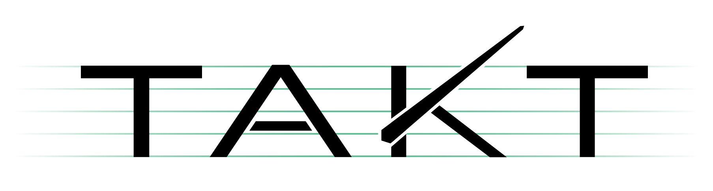
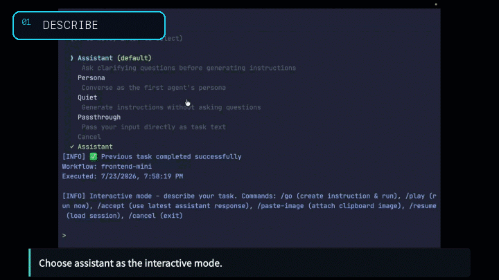
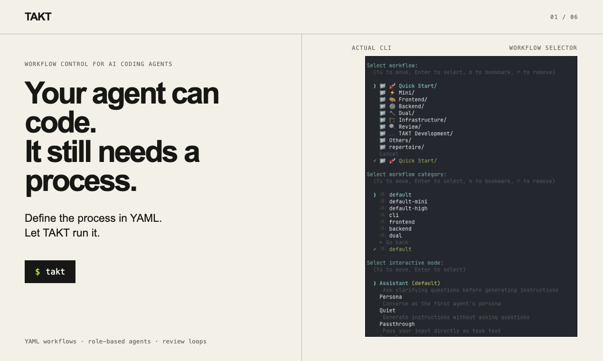

# TAKT

<p align="center">
  <picture>
    <source media="(prefers-color-scheme: dark)" srcset="./docs/assets/takt-logo-dark.svg">
    
  </picture>
</p>

<p align="center">
  <a href="https://www.npmjs.com/package/takt"></a>
  <a href="https://github.com/nrslib/takt/stargazers"></a>
  <a href="https://github.com/nrslib/takt/actions/workflows/ci.yml"></a>
  <a href="./LICENSE"></a>
  <a href="https://discord.gg/R2Xz3uYWxD"></a>
</p>

<p align="center">
  <a href="./README.md">English</a> |
  <a href="./docs/README.ja.md">日本語</a> |
  <a href="./docs/README.zh-CN.md">简体中文</a>
</p>

<p align="center">
  <a href="https://nrslib.github.io/takt/#tutorial">
    
  </a>
</p>

**Stop babysitting AI coding agents.**

TAKT is an open-source CLI that turns AI coding agents into repeatable development workflows. Define planning, implementation, review, fix loops, human checkpoints, permissions, and output contracts in YAML, then run tasks with isolated worktrees and traceable logs.

Instead of asking one agent to remember the whole process, TAKT gives each step its own role, context, and transition rules. Agents can code, but the workflow decides what happens next.



- Run plan → implement → review → fix loops as explicit workflow steps
- Keep context focused with step-specific personas, policies, knowledge, instructions, and output contracts
- Execute queued tasks in isolated worktrees and inspect logs and reports afterward
- Use Claude Code, Claude SDK, Codex SDK, OpenCode SDK, Pi SDK, the official DeepSeek Harness SDK, Cursor, GitHub Copilot CLI, or Kiro as providers

**T**AKT **A**gent **K**oordination **T**opology orchestrates multiple AI agents with structured review loops, managed prompts, and guardrails.

Talk to AI to define what you want, queue it as a task, and run it with `takt run`. Planning, implementation, review, and fix loops are defined in YAML workflow files, so the process is not left to the agent's discretion. TAKT coordinates Claude Code, Codex, OpenCode, Pi, the official DeepSeek Harness SDK, Cursor, GitHub Copilot CLI, and Kiro CLI as agents with different roles, permissions, and context.

TAKT is built primarily for AI coding workflows, but the same model applies beyond coding: any task where multiple AI agents need to coordinate, or where review, judgment, and feedback loops can improve task quality.

TAKT is built with TAKT itself (dogfooding).

## Why TAKT

AI coding agents are powerful, but they do not automatically create a stable development process. In long-running work, they forget instructions, accumulate polluted context, blur implementation and review responsibilities, and often force humans to repeat the same feedback again and again. That wears people down.

Adding more rules to prompts, `CLAUDE.md`, or skills can help, but it cannot enforce the process. Whether the rules are followed is still left to the agent's behavior.

TAKT treats AI agents as something to be controlled from the outside, not simply trusted.

Workflows define the phases, and each step receives its own persona, policy, knowledge, instruction, and output contract. TAKT manages implementation, review, fix, and re-review flows declaratively. By separating responsibilities, knowledge, and constraints, then giving each agent only what it needs for the current step, TAKT improves task quality without bloating context.

Reviews cannot be silently skipped. Findings route work back to fix steps, and human judgment can be requested when needed. Tasks run in isolated worktrees, and each step leaves logs and reports so the path from task to PR remains traceable.

At its core, TAKT runs reusable agent processes built from roles, phases, judgments, and feedback loops.

The goal is simple: make development processes reusable, reviewable, and reproducible without depending on constant human intervention.

## Try It in 5 Minutes

From a Git repository with at least one commit:

```bash
npm install -g takt

# Talk to AI, describe a task, use /go, then choose "Queue as task"
takt

# Execute queued tasks in isolated worktrees
takt run

# Review diffs, merge, retry, requeue, or delete task branches
takt list
```

If this is your first run, configure a provider in `~/.takt/config.yaml` or use the API key environment variables listed in [Configuration](#configuration). SDK-based providers such as `claude-sdk`, `codex`, `opencode`, and `pi` can run with Node.js; `deepseek-harness` additionally requires Python 3.10+ and its official runtime wheel; CLI-based providers require their external CLIs.

### Video Tutorial

Follow the [written tutorial](./docs/tutorial.md) with these hands-on walkthroughs:

| Chapter 1 | Chapter 2 |
|-----------|-----------|
| [](https://youtu.be/HUcFFvOy39I) | [](https://youtu.be/UIlM2iM-rmA) |

## TAKT vs Plain AI Coding Agents

| Plain AI coding agents | TAKT |
|------------------------|------|
| The prompt asks the agent to follow a process | The YAML workflow owns the process |
| Review steps can be forgotten or skipped | Review and fix loops are explicit transitions |
| One long context keeps growing | Each step receives only the context it needs |
| Implementation and review responsibilities blur | Personas, permissions, and output contracts separate responsibilities |
| Work often lands directly in the current tree | Queued tasks run in isolated worktrees by default |
| The path from task to result is hard to audit | Logs and reports preserve the path from task to PR |
| The same process must be recreated by memory | Workflows are reusable, reviewable, and versionable |

## Requirements

TAKT requires Node.js `>=24.15.0`.

The provider you choose determines whether you need to install an external CLI or can run on Node.js alone via a TypeScript SDK.

These providers run via SDK (no CLI required, Node.js only):

- `claude-sdk` — `@anthropic-ai/claude-agent-sdk`
- `codex` — `@openai/codex-sdk`
- `opencode` — `@opencode-ai/sdk`
- `pi` — `@earendil-works/pi-coding-agent`

The `deepseek-harness` provider uses the official Python SDK through a private JSON-RPC bridge. Install the matching SDK/runtime packages with Python 3.10+:

```bash
python3 -m pip install deepseek-harness-sdk deepseek-harness-runtime-bin
```

The official runtime currently supports Linux x64/arm64 and macOS arm64 only. Windows and macOS x64 fail fast; TAKT does not silently fall back to another provider. Set `DEEPSEEK_API_KEY` and optionally `DEEPSEEK_BASE_URL` in the environment. The Python SDK and bundled `deepseek-harness-runtime-bin` must come from matching releases. This provider is a developer-preview compatibility surface: upstream API/event vocabulary may change between matching releases, so use the opt-in live smoke procedure in the configuration guide before relying on a new SDK/runtime pair.

These providers require an external CLI:

- `claude` — [Claude Code](https://claude.ai/code)
- `claude-terminal` — [Claude Code](https://claude.ai/code) driven in an interactive terminal session (also requires [`tmux`](https://github.com/tmux/tmux))
- `copilot` — [GitHub Copilot CLI](https://docs.github.com/en/copilot/github-copilot-in-the-cli)
- `cursor` — [Cursor Agent](https://docs.cursor.com/)
- `kiro` — [Kiro CLI](https://kiro.dev/docs/cli/headless/)

Optional:

- [GitHub CLI](https://cli.github.com/) (`gh`) — for `takt #N` (GitHub Issue tasks)
- [GitLab CLI](https://gitlab.com/gitlab-org/cli) (`glab`) — for GitLab Issue/MR integration (auto-detected from remote URL)

> **OAuth usage:** Whether OAuth is permitted varies by provider and use case. Check each provider's terms of service before using TAKT.

## Quick Start

### Install

```bash
npm install -g takt
```

With Nix flakes:

```bash
nix run github:nrslib/takt
nix profile install github:nrslib/takt
```

The Nix package installs the TAKT CLI itself. External CLI providers, `git`, and `gh`/`glab` still need to be installed and available on `PATH` or configured separately as described in [Requirements](#requirements).

### Talk to AI and queue tasks

```
$ takt

Select workflow:
  ❯ 🎼 default (current)
    📁 🚀 Quick Start/
    📁 🛠️ Development/
    📁 🔍 Review/

> Add user authentication with JWT

[AI clarifies requirements and organizes the task]

> /go

Proposed task:
  ...

What would you like to do?
    Execute now
    Create GitHub Issue
  ❯ Queue as task          # ← normal flow
    Continue conversation
```

Choosing "Queue as task" saves the task to `.takt/tasks/`. Run `takt run` to execute — TAKT creates an isolated worktree, runs the workflow (plan → implement → review → fix loop), and offers to create a PR when done.

```bash
# Execute queued tasks
takt run

# You can also queue from GitHub Issues
takt add #6
takt add #12

# Execute all pending tasks
takt run
```

> **"Execute now"** runs the workflow directly in your current directory without worktree isolation. Useful for quick experiments, but note that changes go straight into your working tree.

### Manage results

```bash
# List task branches — merge, retry, requeue, force-fail, or delete
takt list
```

## How It Works

The name TAKT comes from the German word for "beat" or "baton stroke," used in conducting to keep an orchestra in time. TAKT uses **workflow** and **step** consistently in both user-facing and implementation-facing terminology.

A workflow is defined by a sequence of steps. Use `steps`, `initial_step`, and `max_steps`. Each step specifies a persona (who), permissions (what's allowed), and rules (what happens next). Here's a minimal example:

```yaml
name: plan-implement-review
initial_step: plan
max_steps: 10

steps:
  - name: plan
    persona: planner
    edit: false
    rules:
      - condition: Planning complete
        next: implement

  - name: implement
    persona: coder
    edit: true
    required_permission_mode: edit
    rules:
      - condition: Implementation complete
        next: review

  - name: review
    persona: reviewer
    edit: false
    rules:
      - condition: Approved
        next: COMPLETE
      - condition: Needs fix
        next: implement    # ← fix loop
```

Rules determine the next step. `COMPLETE` ends the workflow successfully, `ABORT` ends with failure. See the [Workflow Guide](./docs/workflows.md) for the full schema, parallel steps, and rule condition types.

Reusable step definitions can be stored in `.takt/steps/` and expanded with `uses` before validation. See the Workflow Guide for fragment lookup and override rules.

The `default` and `takt-default` wrappers bind the generic or TAKT-specific external security-review facet pool only at the reviewer suite that consumes it. `takt-default-team` preserves the same planning, testing, review, and final-gate contracts while switching implementation, remediation, and retry remediation to static Team Leader coder execution; current schema constraints mean that implementation dynamic facets and companions are not used by this variant. Shared development and peer-review workflow contracts remain unchanged. `dynamic_facets` works on normal agent steps and `parallel` agent sub-steps: dynamic parallel participants are selected first, each selected child keeps its fixed facets and receives up to `max_selected` pool candidates, and an empty selection adds nothing. All applicable facet selectors complete before any parallel child starts; if one selection is invalid, no child under that parallel parent starts. A process resume re-runs participant and facet selectors against their current pools.

Workflow files live in `workflows/` as the official directory name.

When the same workflow name exists in multiple locations, TAKT resolves in this order: `.takt/workflows/` → `~/.takt/workflows/` → builtins.

## Recommended Workflows

| Workflow | Use Case |
|-------|----------|
| `default` | Standard development workflow. Scenario-based planning and test-first development with dynamic implementation companions, multi-perspective parallel peer review, adjudication, and a convergent fix loop. |
| `takt-default` | The workflow used to develop TAKT itself. Directly applicable to other CLI tool development. |
| `takt-default-team` | A `takt-default` variant that runs implementation and remediation through Team Leader task decomposition. |
| `review` / `review-fix-default` | Multi-perspective review, without or with a convergent fix loop. |

Domain-specific families (`simple` / `frontend` / `backend` / `dual` / CQRS / `*-mini` variants) remain available under the 📦 Legacy category.

See the [Builtin Catalog](./docs/builtin-catalog.md) for all workflows and personas.

## Key Commands

| Command | Description |
|---------|-------------|
| `takt` | Talk to AI, refine requirements, execute or queue tasks |
| `takt exec` | Start instant Assistant/Worker/Review agent mode without writing workflow YAML |
| `takt add` | Refine a task through AI conversation and queue it (also from GitHub Issues) |
| `takt run` | Execute all pending tasks |
| `takt watch` | Monitor the task queue and auto-execute pending tasks (resident process) |
| `takt list` | Manage task branches (merge, retry, requeue, force-fail, instruct, delete) |
| `takt #N` | Use a GitHub Issue as the initial input for a task |
| `takt eject` | Copy builtin workflows/facets for customization |
| `takt workflow init` | Create a new workflow scaffold |
| `takt workflow doctor` | Validate workflow definitions |
| `takt repertoire add` | Install a repertoire package from GitHub |

See the [CLI Reference](./docs/cli-reference.md) for all commands and options.

TAKT also ships two client-integration entrypoints: `takt-acp` runs TAKT as an [Agent Client Protocol](./docs/cli-reference.md#acp-agent) agent over stdio JSON-RPC, and `takt-mcp` runs it as a stdio [MCP server](./docs/cli-reference.md#mcp-server) so an MCP client (Codex, Claude Code, …) can enqueue tasks with an optional existing or newly created issue. Use `takt run` or `takt watch` to execute pending tasks.

### Instant exec mode

`takt exec` starts TAKT's interactive task-entry mode. The Assistant agent clarifies the request, `/go` turns the conversation into a generated workflow, Worker agent(s) implement the task, Review agent(s) review the result, the Replanning agent asks the user for direction when needed, and loop detection prevents repeated unproductive cycles.

Exec starts from the previous exec configuration, or the default configuration on first run. Pass a preset name to start from that preset. Use `/setup` during the conversation to edit agents, loop detection thresholds, presets, and referenced instruction/knowledge/policy facets. Builtin/default presets define the agent roles, facets, and loop thresholds only. Provider and model are resolved from normal TAKT configuration when exec mode starts, and the same resolved values are used for the Assistant dialogue and `/setup` display. The generated workflow uses capabilities for tool/skill needs; provider/model/options remain in runtime configuration. `effort` is emitted only when it is explicitly configured.

Exec presets resolve in this order: project `.takt/exec/presets/` → global `$TAKT_CONFIG_DIR/exec/presets/` (default `~/.takt/exec/presets/`) → builtin `builtins/exec/presets/`. Changes made in `/setup` are saved to `$TAKT_CONFIG_DIR/exec.yaml` (default `~/.takt/exec.yaml`) for the next exec session. `/setup` can also save or delete project/global presets, and created facets are stored under `.takt/facets/` or `$TAKT_CONFIG_DIR/facets/` (default `~/.takt/facets/`).

When `/go` runs, TAKT generates `.takt/exec/workflow.yaml` and executes it through the normal workflow engine. Inline text after `/go` is treated as an additional note. `/go` without prior conversation or inline task text does not generate the workflow. Use `/cancel` to exit without running.

Exec input supports image attachments while editing the current line. Use `/paste-image` or `Ctrl+V` to attach a clipboard image on macOS, or paste an OSC 1337 inline image from a compatible terminal. TAKT inserts a `[Image #N]` placeholder. Reference that placeholder in an Assistant message or `/go` note to send the image with that Assistant request; placeholders that were not attached in the session are treated as normal text. When `/go` runs, referenced stored images are copied into the generated task spec and listed in its attachment section. Supported image types are PNG, JPEG, GIF, and WebP. Inline and clipboard images are limited to 10 MiB. TAKT rejects unsupported image data, mismatched inline-image filename types, oversized images, and stored attachments whose temp path is missing, a symlink, or not a regular file. Providers without native image input receive the attachment as a local path reference in the prompt.

Normal agent steps, parallel sub-steps, and loop detection judges may set `session_key` to share or isolate persona sessions. System steps, workflow_call steps, and parallel parent steps cannot set `session_key`. TAKT builds the runtime key as `session_key` plus the resolved provider, so values must be non-empty strings that do not collide with other generated session routes.

## Configuration

Minimal `~/.takt/config.yaml`:

```yaml
provider: claude    # claude, claude-sdk, claude-terminal, codex, opencode, deepseek-harness, cursor, copilot, kiro, pi, or mock
model: sonnet       # passed directly to provider
language: en        # en or ja
```

Run metadata, sessions, traces, reports, and other run artifacts remain ordinary
files under `.takt/runs/<run>/`. Resume and requeue preserve the applicable run
state and reports.

The following `config.yaml` example is the retained legacy mode. In runtime mode,
put provider/model/options and routing in `runtime.yaml`; workflow YAML cannot
set them. Use `provider.targets` and `provider.auto_routing` there:

```yaml
provider: codex          # used outside workflow steps and when auto_routing is absent
model: gpt-5.6-sol
takt_providers:
  assistant:             # optional override; interactive / instruct / retry are not auto-routed
    provider: codex
    model: gpt-5.6-sol
auto_routing:
  strategy: balanced   # cost, balanced, or performance
  router:
    provider: codex
    model: gpt-5.6-luna
  candidates:
    - name: advanced
      description: Planning, final decisions, requirement-fulfillment judgment, and other advanced reasoning
      provider: codex
      model: gpt-5.6-sol
      routing_tier: high
    - name: coding
      description: Implementation, tests, debugging, and refactoring
      provider: codex
      model: gpt-5.6-terra
      routing_tier: medium
    - name: lightweight
      description: Formatting and small mechanical edits
      provider: codex
      model: gpt-5.6-luna
      routing_tier: low
  rules:
    steps:
      security-audit: advanced
  default_pool: general
  candidate_pools:
    general:
      candidates: [lightweight, coding, advanced]
      fallback: advanced
    implementation:
      candidates: [coding, advanced]
      fallback: advanced
  pool_rules:
    tags:
      implementation: implementation
```

In legacy mode, operations without workflow-step context use the concrete
top-level provider/model. In runtime mode they use the runtime default.
`auto_routing.router` and candidates are never implicit defaults. Assistant
conversations (interactive planning, instruct, and retry) are not auto-routed:
they use `takt_providers.assistant` in legacy mode or the runtime internal-agent
seat. CLI provider/model overrides apply only where the command supports them.

Auto-routing decisions are written locally to `.takt/events/` as NDJSON. TAKT does not upload routing decisions. Local recording is enabled by default, can be configured with `telemetry.routing_decisions`, and can be inspected or changed with `takt telemetry status|enable|disable`.

Or use provider credentials directly (no CLI installation required for claude-sdk, Codex, OpenCode, Pi, or DeepSeek Harness when its Python SDK/runtime is installed):

```bash
export TAKT_ANTHROPIC_API_KEY=sk-ant-...   # Anthropic (Claude)
export TAKT_OPENAI_API_KEY=sk-...          # OpenAI (Codex)
export TAKT_OPENCODE_API_KEY=...           # OpenCode
export TAKT_CURSOR_API_KEY=...             # Cursor Agent (optional if logged in)
export TAKT_COPILOT_GITHUB_TOKEN=ghp_...   # GitHub Copilot CLI
export TAKT_KIRO_API_KEY=...               # Kiro CLI
export DEEPSEEK_API_KEY=...                 # Official DeepSeek Harness SDK
# Optional: export DEEPSEEK_BASE_URL=https://...
# Pi uses its SDK credential store or provider-native environment variables.
```

See the [Configuration Guide](./docs/configuration.md) for all options, provider profiles, and model resolution.

OpenCode calls have a 60-minute wall-clock limit by default. Calls that may run
longer than 60 minutes must set `provider_options.opencode.guards.call_timeout_ms`
explicitly (up to 86,400,000 ms). Guard profiles and per-model overrides can be
configured as follows; `model_profiles` uses first-match order and `*` wildcards:

```yaml
provider_options:
  opencode:
    guards:
      profile: standard
      model_profiles:
        "opencode/big-pickle": minimal
        "lmstudio/*": standard
      call_timeout_ms: 7200000
      text_byte_limit: 1048576
      reasoning_byte_limit: 4194304
```

The removed `TAKT_OPENCODE_TOOL_ERROR_BUDGET`,
`TAKT_OPENCODE_TOOL_SIGNATURE_ABSOLUTE`,
`TAKT_OPENCODE_TOOL_SIGNATURE_REPEATS`,
`TAKT_OPENCODE_TOOL_SUCCESS_REPEATS`, and
`TAKT_OPENCODE_TOOL_RESULT_STAGNATION_REPEATS` variables are ignored and emit a
one-time migration warning. See the configuration guide for the v6 guard policy.

### Dedicated provider configuration (`runtime.yaml`)

Provider, model, provider options, auto routing, and internal-agent assignment
can live in a dedicated layer instead of `config.yaml`: `~/.takt/runtime.yaml`
and `<project>/.takt/runtime.yaml`, with the project layer winning.
`runtime.yaml` replaces the `config.yaml` provider keys as the
configuration-layer default; CLI and environment overrides remain available.
Workflow YAML has no provider/model/options/routing layer: removed fields,
workflow-call overrides, and target-specific promotion settings fail at load
time with a migration hint. Promotion only advances the runtime target ladder,
while provider and model resolve independently per runtime target. Mixing
`runtime.yaml` with the legacy provider keys is rejected with a diagnostic
naming the file and the key to migrate to. Without a `runtime.yaml`,
`config.yaml` behaves exactly as before. See
[docs/configuration.md](docs/configuration.md) for the schema and the
migration table.

Companion reviewers are disabled by default. To enable them, set the
top-level policy in `runtime.yaml`:

```yaml
version: 1
companion:
  enabled: true
```

When both global and project policies are set, they are combined with logical
AND, so a global `false` cannot be re-enabled by a project setting. An omitted
policy is neutral during layer merging; Companion stays disabled when neither
layer specifies one.

## Customization

### Custom workflows

```bash
takt workflow init my-flow   # Create a new workflow scaffold
takt workflow doctor my-flow # Validate a workflow definition
takt eject default           # Copy builtin workflow to ~/.takt/workflows/ and edit
```

### Custom personas

Create a Markdown file in `~/.takt/facets/personas/`:

```markdown
# ~/.takt/facets/personas/my-reviewer.md
You are a code reviewer specialized in security.
```

Reference it in your workflow: `persona: my-reviewer`

`~/.takt/personas/` still works as a compatibility path, but `takt catalog` only scans the `facets/` directories.

See the [Workflow Guide](./docs/workflows.md) for details. The list of builtin personas is in the [Builtin Catalog](./docs/builtin-catalog.md).

## CI/CD

TAKT provides [takt-action](https://github.com/nrslib/takt-action) for GitHub Actions:

```yaml
- uses: nrslib/takt-action@main
  with:
    anthropic_api_key: ${{ secrets.TAKT_ANTHROPIC_API_KEY }}
    github_token: ${{ secrets.GITHUB_TOKEN }}
```

For other CI systems, use pipeline mode:

```bash
takt --pipeline --task "Fix the bug" --auto-pr
```

See the [CI/CD Guide](./docs/ci-cd.md) for full setup instructions.

## Project Structure

```
~/.takt/                    # Global config
├── config.yaml             # Provider, model, language, etc.
├── workflows/              # User workflow definitions
├── facets/                 # User facets (personas, policies, knowledge, etc.)
└── repertoire/             # Installed repertoire packages

.takt/                      # Project-level
├── config.yaml             # Project config
├── workflows/              # Project workflow overrides
├── facets/                 # Project facets
├── tasks.yaml              # Pending tasks
├── tasks/                  # Task specifications
└── runs/                   # Execution reports, logs, context
```

Workflow definitions are stored under `workflows/`.

## Adopting Spec-Driven Development

TAKT enforces phase transitions declaratively as a YAML state machine, formalizes the artifact of each phase with output contracts, and routes deviations back via parallel review and fix loops. This structure is particularly well-suited for users who follow Spec-Driven Development (SDD) and keep the spec at the center of the process. Once the spec is well-defined, the AI cannot silently skip a phase, drop an acceptance criterion, or claim "done" without passing the verification gate.

For users who want to adopt SDD, the community provides [j5ik2o/takt-sdd](https://github.com/j5ik2o/takt-sdd) as a ready-made implementation. It ships workflows for Requirements → Gap Analysis → Design → Tasks → Implementation → Validation, plus an OpenSpec-style change-proposal flow. Install in one command:

```bash
npx create-takt-sdd
```

See [External Integrations](./docs/external-integrations.md) for other community integrations.

## Documentation

| Document | Description |
|----------|-------------|
| [Tutorial](./docs/tutorial.md) | Improve one example over three phases while queuing, running, and inspecting tasks |
| [CLI Reference](./docs/cli-reference.md) | All commands and options |
| [Configuration](./docs/configuration.md) | Global and project settings |
| [Observability](./docs/observability.md) | Phase-level usage events and analysis workflow |
| [Design Philosophy](./docs/design-philosophy.md) | Why TAKT is built around workflows, facets, feedback loops, and traceability |
| [Workflow Guide](./docs/workflows.md) | Creating and customizing workflows |
| [Builtin Catalog](./docs/builtin-catalog.md) | All builtin workflows and personas |
| [Faceted Prompting](./docs/faceted-prompting.md) | Prompt design methodology |
| [Token Saving](./docs/token-saving.md) | Measuring and reducing token consumption |
| [Repertoire Packages](./docs/repertoire.md) | Installing and sharing packages |
| [Task Management](./docs/task-management.md) | Task queuing, execution, isolation |
| [CI/CD Integration](./docs/ci-cd.md) | GitHub Actions and pipeline mode |
| [External Integrations](./docs/external-integrations.md) | Community examples that extend TAKT without modifying core (audit trails, etc.) |
| [Changelog](./CHANGELOG.md) ([日本語](./docs/CHANGELOG.ja.md)) | Version history |

### Simplified Chinese documentation

Simplified Chinese documentation uses the `.zh-CN.md` suffix so it can coexist with the English and Japanese pages. Start with the [Chinese documentation index](./docs/README.zh-CN.md).

Translated coverage includes the onboarding path (README, tutorial, configuration, and CLI reference), workflow authoring, provider/external integrations, and task management. The remaining catalog, observability, design, prompting, token-saving, repertoire, CI/CD, testing, contributing, changelog, and internal design/development pages remain available in English or Japanese and are intentionally not duplicated here.

## Sponsors

TAKT is supported by [CodeRabbit](https://coderabbit.link/nrslib) through its Open Source Support Program.

<a href="https://coderabbit.link/nrslib">
  <picture>
    <source media="(prefers-color-scheme: dark)" srcset="https://victorious-bubble-f69a016683.media.strapiapp.com/White_Typemark_79b9189d19.svg">
    <source media="(prefers-color-scheme: light)" srcset="https://victorious-bubble-f69a016683.media.strapiapp.com/Orange_Typemark_43bf516c9d.svg">
    
  </picture>
</a>

## Community

Join the [TAKT Discord](https://discord.gg/R2Xz3uYWxD) for questions, discussions, and updates.

## Contributing

See [CONTRIBUTING.md](./CONTRIBUTING.md) for details.

## License

MIT — See [LICENSE](./LICENSE) for details.
